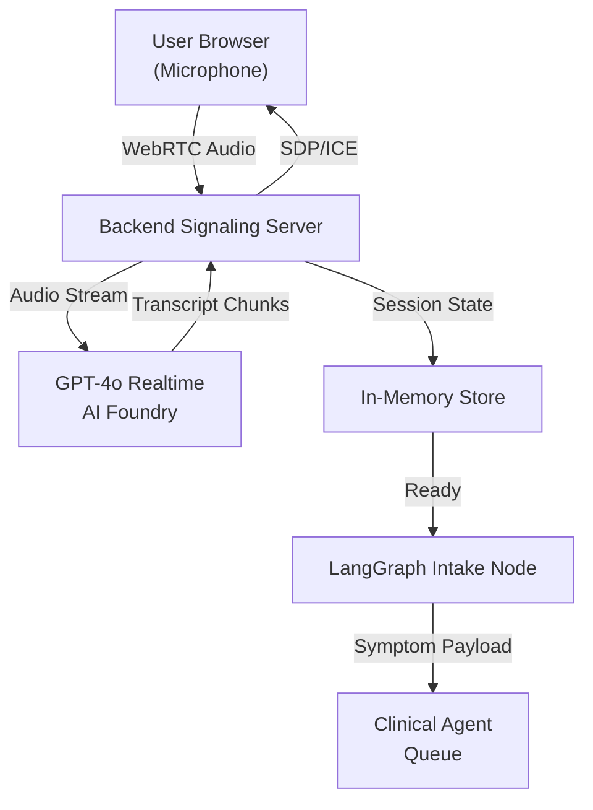

# Intake Agent Architecture

## Overview

The **Intake Agent** is the first node in the multi-agent triage workflow. It captures patient symptoms via real-time conversation using the GPT-4o Realtime API (hosted on Azure AI Foundry), streams audio over WebRTC, and extracts structured symptom data for downstream clinical assessment.

## System Components

### 1. Frontend (TypeScript)

- **Microphone Capture UI**: Users speak their symptoms in their preferred language
- **Language Selector**: Initial language preference for the conversation
- **Transcript Display**: Real-time transcript of the conversation with the intake agent
- **WebRTC Connection**: Establishes peer connection with backend signaling server

**Transport**: WebRTC for low-latency, peer-to-peer audio streaming (UDP-based, no head-of-line blocking)

### 2. Backend Signaling & Session Management (Python/uv)

- **WebRTC Signaling Server**: Handles SDP negotiation, ICE candidates, and connection establishment
- **GPT-4o Realtime Client**: Wrapper around Azure AI Foundry GPT-4o Realtime endpoint
- **Session Store** (in-memory): Maintains live session state, transcripts, and extracted symptoms
- **LangGraph Orchestrator**: Routes messages between WebRTC, GPT-4o Realtime, and state management

### 3. Azure AI Foundry Integration

- **GPT-4o Realtime API**: Receives audio stream, outputs transcription + multilingual understanding + initial guidance
- **Credential Management**: API keys/tokens loaded from environment (development) or managed identity (production)

## Data Flow



## LangGraph Node Definition

**Node: `intake_conversation`**

- **Input**: Audio stream + session metadata (user ID, language preference)
- **State**: `IntakeSessionState` (transcript, confidence, extracted symptoms, status)
- **Processing**:
  1. Stream audio to GPT-4o Realtime API
  2. Collect transcript chunks in real-time (send to frontend via WebSocket updates)
  3. When conversation concludes (user-initiated or timeout), call symptom extraction
  4. Return structured symptom payload
- **Output**: `SymptomPayload` (JSON with symptom fields, confidence scores, metadata)

## In-Memory Session Store

**Schema** (keyed by session ID):

```python
@dataclass
class IntakeSessionState:
    session_id: str
    user_language: str
    start_time: datetime
    transcript_chunks: List[str]  # Real-time transcript updates
    final_transcript: str  # Complete transcript when finished
    extracted_symptoms: SymptomPayload  # Structured data
    status: Literal["active", "completed", "timeout", "error"]
    error_message: Optional[str]
```

**Lifecycle**:

- Created when frontend initiates WebRTC connection
- Updated continuously as transcript arrives
- Marked as `completed` when intake conversation ends
- Cleaned up after TTL (e.g., 24 hours) or explicit session close

## API Contracts

### WebRTC Signaling Endpoints

**POST `/api/intake/sessions`**

- Creates a new intake session
- **Request**: `{ "user_language": "en" | "es" | "fr" | ... }`
- **Response**: `{ "session_id": "uuid", "ice_servers": [...] }`

**POST `/api/intake/sessions/{session_id}/offer`**

- Receives WebRTC offer from frontend
- **Request**: `{ "sdp": "..." }`
- **Response**: `{ "sdp": "..." }`  (answer)

**POST `/api/intake/sessions/{session_id}/candidates`**

- Receives ICE candidates from frontend
- **Request**: `{ "candidates": [...] }`
- **Response**: `{ "ack": true }`

**WebSocket `/ws/intake/{session_id}/events`**

- Real-time event stream from intake agent
- Events: `transcript_chunk`, `status_update`, `symptom_complete`, `error`

### Intake → Clinical Agent Handoff

**Symptom Payload (JSON)**:

```json
{
  "session_id": "uuid",
  "user_id": "uuid",
  "language": "en",
  "transcript": "I have a headache and fever for 2 days...",
  "extracted_symptoms": {
    "chief_complaint": "headache, fever",
    "duration": "2 days",
    "severity": { "headache": "moderate", "fever": "mild" },
    "associated_symptoms": ["nausea"],
    "medication_history": [],
    "allergies": []
  },
  "confidence_scores": {
    "chief_complaint": 0.95,
    "duration": 0.90,
    "severity": 0.85
  },
  "timestamp": "2025-11-15T12:00:00Z"
}
```

## GPT-4o Realtime Integration Notes

1. **Multilingual Support**: GPT-4o Realtime natively handles speech/text in multiple languages; no separate translation step needed.
2. **Streaming**: Audio frames stream in real-time; transcript chunks arrive incrementally (enable frontend to show live updates).
3. **Session Context**: Each intake session maintains a conversation context with the model (no multi-turn history persisted after intake ends).
4. **Fallback**: If audio quality is poor or connection drops, gracefully degrade to text input or offer retry.

## Testing Strategy

1. **Unit Tests**:
   - Mock GPT-4o Realtime with sample transcripts
   - Test symptom extraction logic (transcript → JSON payload)
   - Verify session state transitions (active → completed → cleanup)

2. **Integration Tests**:
   - WebRTC signaling mock with sample SDP/ICE candidates
   - End-to-end intake flow (WebRTC connect → transcript → symptom extraction)

3. **Load Testing** (future):
   - Concurrent intake sessions to validate in-memory store scalability
   - Measure latency (audio capture → symptom ready) under load

## Environment & Configuration

**Backend**:

- `AZURE_FOUNDRY_ENDPOINT`: AI Foundry GPT-4o Realtime endpoint URL
- `AZURE_FOUNDRY_API_KEY`: API key for authentication
- `SESSION_TTL_HOURS`: In-memory session retention (default: 24)
- `STUN_SERVERS`: List of STUN server URLs for WebRTC (e.g., `stun:stun.l.google.com:19302`)

**Frontend**:

- `VITE_BACKEND_URL`: Backend signaling server URL (e.g., `https://localhost:8000`)

## Future Enhancements

1. **Persistence**: Migrate in-memory store to a database for durability and multi-pod deployments.
2. **Compliance**: Add HIPAA-compliant logging, PII redaction, and audit trails.
3. **Observability**: Distributed tracing (OpenTelemetry), structured logging, and metrics (latency, success rates).
4. **Resilience**: Retry logic, circuit breakers, and fallback intake modes (text-only, pre-defined forms).
